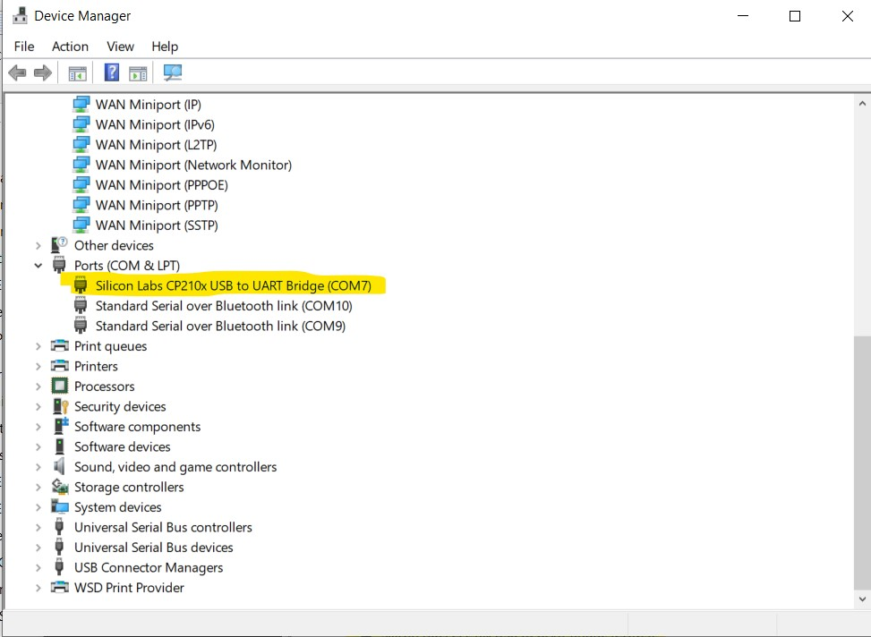
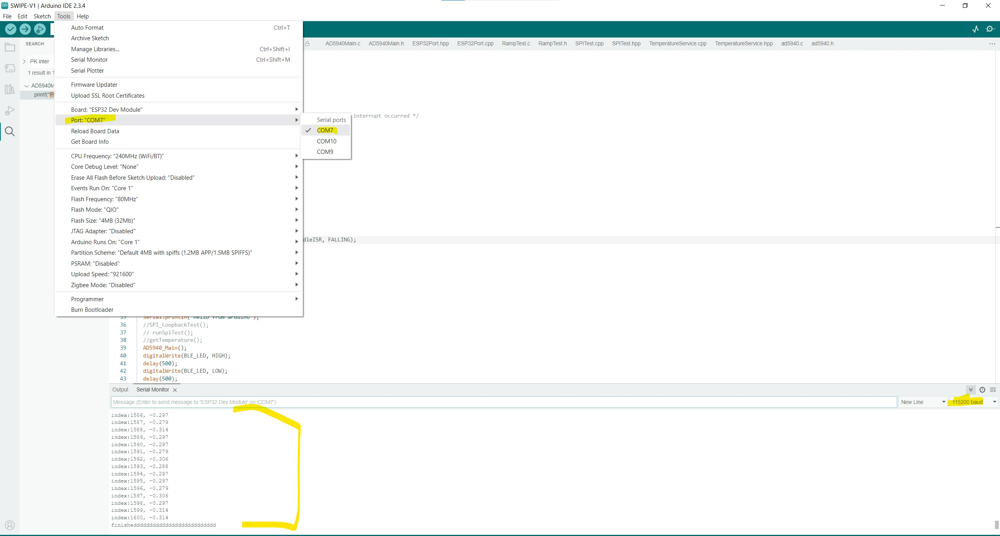

# SWIPE  
Code for the wearable **SWIPE** (Skin Wearable for Iontophoresis and Potentiostats Experiment) PCB.

---

## Setting Up the SWIPE Environment  

Follow these steps to set up the SWIPE environment:  

### 1. Install VCP Drivers  
1. Download the [VCP drivers](https://www.silabs.com/developer-tools/usb-to-uart-bridge-vcp-drivers?tab=downloads).  
   - For Windows users, click **"CP210x VCP Windows"** to download.  
2. Once the download is complete, unzip the folder.  
3. Locate the `silabser.inf` file in the folder, right-click on it, and select **"Install"**.  
     
4. Open **Device Manager** on your Windows machine.  
   - Look under **Ports** for a device called **"Silicon Labs CP210x USB to UART Bridge"**.  
   - Note the COM port number (e.g., COM3).  
       

---

### 2. Install Arduino IDE  
1. Download the Arduino IDE (version 2.0 or higher) from [here](https://www.arduino.cc/en/software).  
2. Follow the installation instructions for your operating system.  

---

### 3. Install ESP32 Libraries  
1. Open the Arduino IDE and install the ESP32 Espressif libraries:  
   - Follow the instructions in the **"Installing ESP32 Add-on in Arduino IDE"** section from [this guide](https://randomnerdtutorials.com/installing-the-esp32-board-in-arduino-ide-windows-instructions/).  
2. Once installed, select **"ESP32 Dev Module"** from the board dropdown menu in the Arduino IDE.  
   Warning: selecting the wrong module can lead to undefined behavior!
     

---

### 4. Compile and Flash the Code  
1. Open the SWIPE code in the Arduino IDE.  
2. Make sure that ESP32 Wrover kit is selected and the right COM port is selected.
3. Click the **"Upload"** button (top-left corner) to compile and flash the code onto the board.  
   
---

### 5. Read Data from the COM Port  
1. Open **Device Manager** and confirm the correct COM port number as noted earlier.  
2. In the Arduino IDE:  
   - Open the **Serial Monitor**.  
   - Select the correct COM port.  
   - Set the baud rate to **115200**.  
     

---
